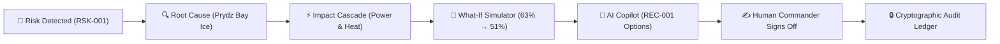

# POLAR-AI ❄️
### Autonomous Mission Operating System & Polar Expedition Continuity Intelligence

> **MoES & NCPOR Aligned Decision-Support Platform**  
> Serving the *44th Indian Scientific Expedition to Antarctica (ISEA-44)* across **Maitri Station**, **Bharati Station**, and **Himadri (Arctic)**.

[](https://polar-ai-psi.vercel.app/)
[](https://vitejs.dev/)
[](https://react.dev/)
[](https://tailwindcss.com/)
[](https://threejs.org/)
[](LICENSE)

---

## 🌐 Live Production Application

- **Live URL**: **[https://polar-ai-psi.vercel.app/](https://polar-ai-psi.vercel.app/)**
- **GitHub Repositories**:
  - Primary: [https://github.com/bhavishyaone1/POLAR-AI](https://github.com/bhavishyaone1/POLAR-AI)
  - Mirror: [https://github.com/bhavishyaone1/Polar_Command_Center](https://github.com/bhavishyaone1/Polar_Command_Center)

---

## 1. Executive Summary & Core Value Proposition

Operating scientific research bases in the Antarctic interior requires managing multi-week maritime supply pipelines, sub-zero katabatic blizzards, mission-critical diesel microgrids, and isolated crew safety.

Traditional polar expedition management relies on fragmented, reactive spreadsheets, static paper logs, and manual guesswork. When pack-ice impedes a supply vessel or a primary generator approaches its service ceiling, station commanders must manually deduce downstream repercussions across separate documents.

**POLAR-AI** transforms polar operations from reactive bookkeeping into an **autonomous, predictive, explainable Mission Operating System**:
- **Predicts** critical resource depletion horizons before shortages occur.
- **Traces** systemic risk cascades across logistics, generators, microgrids, and science labs.
- **Simulates** perturbations in an isolated, non-mutating What-If sandbox.
- **Guides** command officers with context-aware AI recommendations safeguarded by human-in-the-loop authorization and an immutable cryptographic ledger.

---

## 2. Core Philosophy: Device-Optimized Architecture

POLAR-AI does not simply scale down a desktop layout onto a mobile phone. Instead, it embodies a dual-experience philosophy:

```
┌──────────────────────────────────────────────────────────┐
│                   POLAR-AI PLATFORM                      │
├────────────────────────────┬─────────────────────────────┤
│    DESKTOP WORKSPACE       │       MOBILE COMPANION      │
│  (Screen Width ≥ 1024px)   │    (Screen Width < 768px)   │
├────────────────────────────┼─────────────────────────────┤
│ • Powerful Mission Control │ • Focused 3-Second Companion│
│ • 12-Column Telemetry Grid │ • 5-Pillars Bottom Nav      │
│ • Interactive 2D/3D Globe  │ • Single-Column Thumb Flow  │
│ • Full Simulation Sandbox  │ • Guided Delay Stepper Flow │
│ • Multi-Pane Copilot Space │ • 5-Part Structured AI Card │
│ • High-Density Data Tables │ • Touch-Friendly Card Views │
└────────────────────────────┴─────────────────────────────┘
```

### 🖥️ Desktop: Powerful Mission-Control Workspace
- **Station Command Hero Banner**: Photorealistic Antarctic research station backdrop with live GPS coordinates, Austral Summer campaign badges, and real-time operational readiness telemetry.
- **Signature 63% Mission Continuity Donut**: Dominant 4-column radial gauge ($r=42$) with plain-English deficit explanation and transparent mathematical point attribution.
- **12-Column Operational Grid**: Balanced operational metrics (Critical Risk, Maritime Cargo, Fuel Inventory, Power Assets) with large, detached numeric typography and one-click action triggers.
- **Tri-Column Operations Center**: 6-column vector Antarctic map with waypoint corridors, 3-column chronological event timeline, and 3-column AI brief with drift detection.

### 📱 Mobile: Focused Mission-Control Companion
- **3-Second Comprehension Hierarchy**:
  1. **How is the mission?** $\to$ **Mission Continuity**: `63%` with *Stable with emerging risk* subtitle and 1-tap `Why is score 63%? →` breakdown.
  2. **What is the biggest problem?** $\to$ **Priority Risk**: *Fuel Resupply Gap* (`5-day gap`) with immediate `View Risk →` CTA.
  3. **What should I review?** $\to$ **Mission Pulse**: Clean vertical cards for *Fuel*, *Cargo*, *Power*, and *Personnel*.
- **Ergonomic 5-Pillars Bottom Navigation**: Dedicated $\ge 48$px touch targets for **Home**, **Operations**, **Risk**, **Simulator**, **AI**, plus a slide-over **More** drawer.
- **Table-to-Card Transformation**: Wide multi-column data tables automatically transform on phones into thumb-friendly cards with mono ID tags, status badges, and $\ge 44$px touch targets.
- **Safe-Area Insets**: Full clearance for modern iOS and Android device navigation bars (`pb-[env(safe-area-inset-bottom)]`).

### 📟 Tablet: Seamless Adaptive Bridge (768px–1023px)
- **Responsive 2-Column Wrapping**: Metrics and panels adapt smoothly without cramped numbers or horizontal overflow.
- **Accessible Hamburger Navigation**: Ergonomic 40x40 hamburger toggle opening the sidebar drawer with backdrop blur.

---

## 3. The Signature POLAR-AI Operating Loop

POLAR-AI structures decision-making into a continuous, explainable pipeline:

$$\text{Risk Detected} \longrightarrow \text{Why?} \longrightarrow \text{Cascade Impact} \longrightarrow \text{Simulate} \longrightarrow \text{AI Options} \longrightarrow \text{Human Authorization}$$



---

## 4. Key Modules & Intelligence Capabilities

### 🛡️ 1. Explainable Mission Continuity Engine
- Real-time algorithmic synthesis across inventory burn, machinery health, cargo pipelines, blizzard alerts, and personnel duty statuses.
- **Deterministic Formula**:
  $$\text{Score } (63\%) = \text{Baseline } (85\%) + \text{Positive Factors } (+5\%) - \text{Negative Deductions } (-27\%)$$
- Point Deductions:
  - `-15%`: Fuel resupply deficit gap at Maitri (14,200 L reserve vs Day 17 ETA).
  - `-8%`: Cargo sea-ice impediment (Consignment C-101 delayed +3 days).
  - `-4%`: Generator G-01 service limit (60 operating hours remaining).
  - `+2%`: Personnel roster compliance (100% check-in).
  - `+3%`: Microgrid & SATCOM stability.

### 🧪 2. What-If Mission Simulator
- **Desktop**: Rich simulation sandbox with delay sliders, generator outage toggles, and consumption surge multipliers.
- **Mobile Guided Flow**:
  - *"What if fuel shipment is delayed?"*
  - Stepper: `− [ 5 DAYS ] +`
  - `RUN SIMULATION` $\to$ Score drops `63% → 51%`
  - Downstream cascade: `Fuel → Generator → Power → Heating → Research`
  - AI Recommendation: *"Review alternate resupply options before Day 12."*
  - 1-tap `Authorize Mitigation REC-001`.

### 🤖 3. Context-Aware AI Mission Copilot
- Replaces generic chatbots with structured, grounded polar operational reasoning.
- **5-Part Structured Response Format** across both Desktop and Mobile:
  1. **`ANALYSIS`**: Root-cause telemetry evaluation.
  2. **`IMPACT`**: Downstream infrastructure consequences.
  3. **`PREDICTION`**: Score and buffer decay trajectory.
  4. **`OPTIONS`**: Distinct operational choices (Option A vs Option B).
  5. **`RECOMMENDED REVIEW`**: Specific mitigation action with 1-click authorization.
- Rapid touch chips: *Why is this a risk?*, *What changed?*, *What happens if shipment delayed?*, *What should I review?*, *Explain the impact*, *Compare REC-001 vs REC-002*.

### 🕸️ 4. Systemic Risk & Cascading Dependency Graph
- Directed Acyclic Graph (DAG) modeling inter-system physics:
  $$\text{Fuel Reserve} \longrightarrow \text{CAT 3512 Generator} \longrightarrow \text{Microgrid (450 kW)} \longrightarrow \text{Hydronic Heating} \longrightarrow \text{Cryogenic Science Vaults}$$
- Allows commanders to trace blast radiuses from single logistics bottlenecks to station-wide life support.

### 📦 5. Freight & Maritime Cargo Tracking
- Tracks consignment status (`STAGED`, `IN TRANSIT`, `DELAYED`, `DELIVERED`), maritime coordinates, cargo vessels, and priority tiers.
- Slide-over inspection drawers with resupply lifecycle trackers and downstream dependency linkage.

### 🛢️ 6. Inventory & Dynamic Consumption Runways
- Continuous burn rate calculations (e.g. Maitri Diesel: `14,200 L` @ `1,180 L/day` = `12.0 days runway`).
- Automated Last Safe Resupply Date flags and strategic reserve transfer protocols.

### 🚨 7. Fail-Safe Armed SOS & Emergency Command
- 2-stage armed dispatch protocol to prevent accidental polar distress signaling.
- 100% offline edge triage with spherical Haversine spatial trigonometry for nearest responder dispatch, blood-type matching, and tracked vehicle ETA.

### 🌍 8. Tactical 2D Vector Map & 3D Three.js Earth Globe
- High-contrast 2D tactical polar canvas with route lines and incident pulse beacons.
- Hardware-accelerated 3D WebGL realistic Earth globe powered by **Three.js** featuring ocean bathymetry, atmospheric glow, and 3D polar station coordinates.

### 🔒 9. Cryptographic Immutable Audit Ledger
- Records every human officer decision, recommendation approval, and emergency dispatch with tamper-evident SHA-256 hashes.

---

## 5. Technology Stack & Design System

| Layer | Technology | Purpose |
| :--- | :--- | :--- |
| **Frontend Framework** | React 18.3.1 | Component architecture & state management |
| **Build Tool** | Vite 8.2.2 | Fast HMR & optimized production bundling |
| **Styling & Tokens** | Tailwind CSS 3.4.17 | Precision layouts & utility styling |
| **Typography** | Inter & IBM Plex Mono | Clean UI headers/body + technical telemetry mono |
| **3D Visualization** | Three.js 0.186 | Spherical WebGL globe & orbital camera controls |
| **2D Mapping** | Leaflet 1.9.4 | Tactical polar cartography & incident coordinates |
| **Icons** | Lucide React 0.468 | High-clarity operational iconography |
| **Charts** | Recharts 2.13 | High-contrast telemetry & burn rate trends |
| **Edge Hosting** | Vercel Edge Network | Global CDN, SSL/TLS, client-side SPA routing |

---

## 6. Getting Started & Local Development

### Prerequisites
- Node.js (v18.0 or higher recommended)
- npm or yarn

### Installation & Setup

```bash
# 1. Clone the repository
git clone https://github.com/bhavishyaone1/POLAR-AI.git
cd POLAR-AI

# 2. Install dependencies
npm install

# 3. Start local development server
npm run dev
```

The application will be running locally at `http://localhost:5173/`.

### Building for Production

```bash
# Compile and bundle into dist/
npm run build

# Preview production build locally
npm run preview
```

---

## 7. Automated Verification & Quality Assurance Suites

The repository contains automated test and validation scripts:

```bash
# 1. Verify component & icon syntax across all files
node scripts/verify-all.mjs

# 2. Run deep static audit, import resolver & asset integrity
node scripts/deep-audit.mjs

# 3. Scan React keys, null-safety, and loop robustness
node scripts/deep-react-checker.mjs

# 4. Test local dev server HTTP endpoints
node scripts/test-local-server.mjs
```

### Verification Suite Results

| Suite | Scope | Result |
| :--- | :--- | :--- |
| **Icon & Component Syntax** | 114 files in `src/` | **0 errors** |
| **Static Import Resolver** | 100% of internal & external imports | **0 errors, 0 warnings** |
| **React Key & Robustness** | 65 JSX components | **0 actionable issues** |
| **Vite Production Build** | Full bundling into `dist/` | **Built in ~6s, 0 errors** |
| **Live Server Health** | Root & module routes | **HTTP 200 OK** |

---

## 8. Deployment Architecture

POLAR-AI is configured for zero-configuration continuous deployment on **Vercel**, **Netlify**, and **Cloudflare Pages**:
- **[`vercel.json`](vercel.json)**: Configures build command, output directory (`dist`), and SPA rewrites (`/(.*) -> /index.html`).
- **[`public/_redirects`](public/_redirects)**: Supports Netlify and Cloudflare Pages SPA client-side routing.
- **[`.github/workflows/ci.yml`](.github/workflows/ci.yml)**: Continuous integration pipeline verifying production builds on every push to `main`.

---

## 9. License & Attribution

- **License**: Released under the [MIT License](LICENSE).
- **Institution**: Developed for demonstration and architectural evaluation in alignment with the **Ministry of Earth Sciences (MoES)** and the **National Centre for Polar and Ocean Research (NCPOR)**, Government of India.
